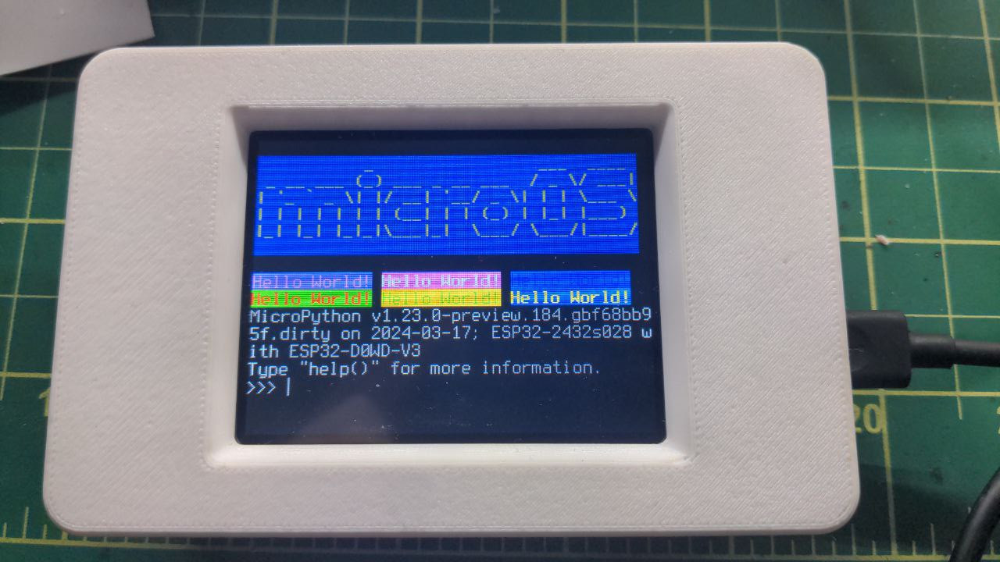

# TBTerm

Text Buffer Terminal class for MicroPython

You can redirect REPL to this buffer.

## Features

- Hardware and software scrolling
- All orientations supported
- 256 ANSI color mode for background and foreground colors
- Regular and Bold font


## Usage

While the original project had HAL support, this project ties in directly with [russhughes's st7789 driver](https://github.com/russhughes/st7789_mpy).
The example below duplicates REPL output to a ST7789 compatible display connected to ESP32 via SPI.
```
import st7789
import terminus_bold
import terminus_regular 
import tft_config
from tbterm import TBTerm
import os

rotation = 1
scr = TBTerm(tft_config.config(rotation), terminus_regular, terminus_bold, rotation)
os.dupterm(scr)
print("\033[38;5;206;48;5;57mHello World!\033[0m \033[38;5;253;48;5;201;1mHello World!\033[0m \033[38;5;18;48;5;20mHello World!\033[0m")
print("\033[91;102;1mHello World!\033[0m \033[92;103mHello World!\033[0m \033[93;104;1mHello World!\033[0m")
os.dupterm(None)
```

## terminus font

terminus.py and terminus_bold.py, both converted from the original Terminus font, are the fonts I am using for the screenshots.



